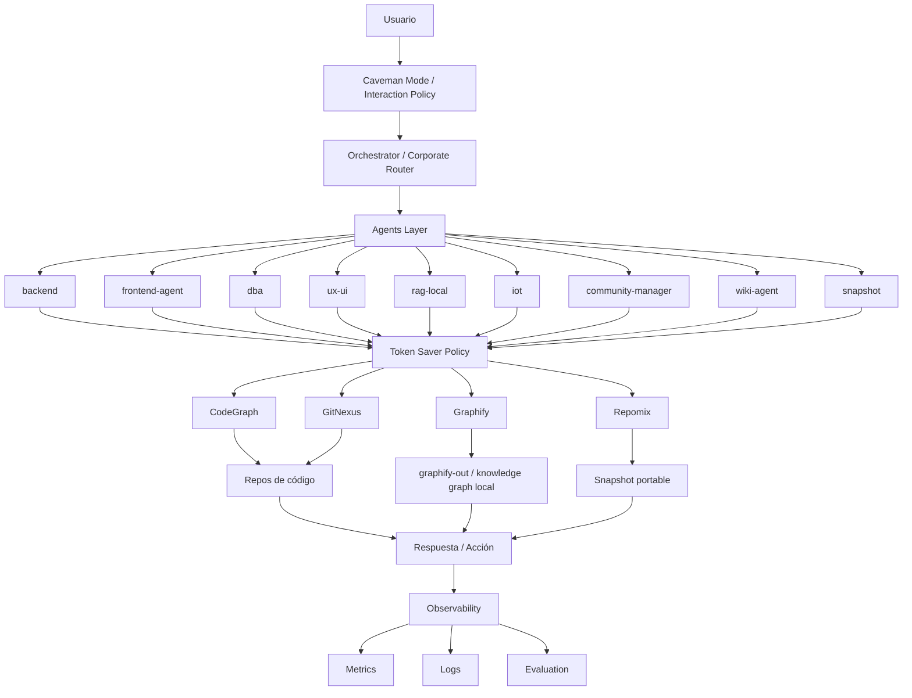

# Arquitectura de MCP Efficiency Engine



## Lectura rápida

```txt
Caveman optimiza cómo se habla.
Token Saver optimiza qué contexto se usa.
Routing decide qué motor se usa.
Observability mide si todo funciona.
```

Modo operativo activo:

- Flujo por defecto sin RAG.
- Conocimiento de proyecto en local mediante MarkItDown + Graphify + grafos de código.

## Routing base (resumen)

- `backend` y `frontend-agent` -> `CodeGraph`
- `backend` (multi-repo) -> `GitNexus`
- `dba`, `ux-ui`, `rag-local`, `community-manager` -> `Graphify`
- `wiki-agent` -> `CodeGraph` (fallback `Graphify`)
- `snapshot` -> `Repomix`
